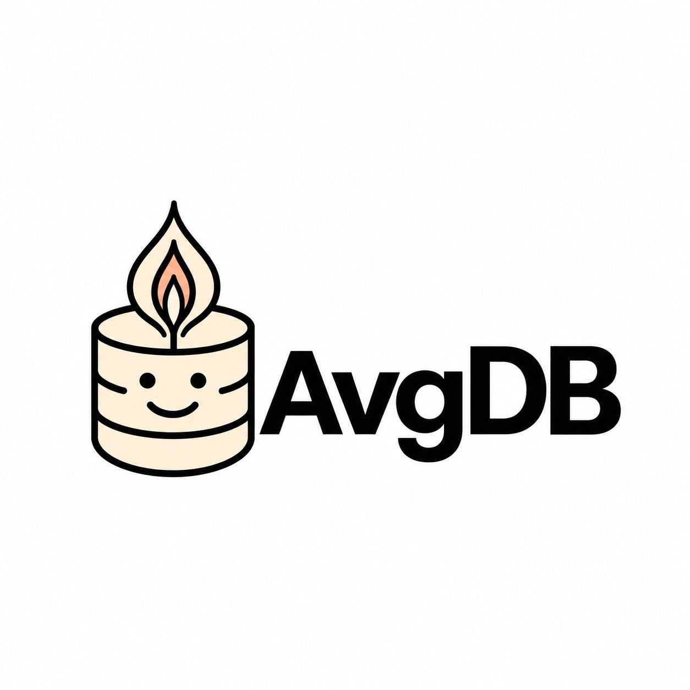

### AverageDB

The only database built from the ground for the average developer.

[https://averagedatabase.com](https://averagedatabase.com)

### Hosting

The whole site is one Cloudflare Worker deployment. TanStack Start prerenders
the public pages as static assets, while the same Worker handles the small API,
testimonial avatars, and the request-dependent incident redirect. Disposable
database values live in D1 and uploads live in R2.

### Support

Open an issue - we can't afford Slack yet until our vc check clears
